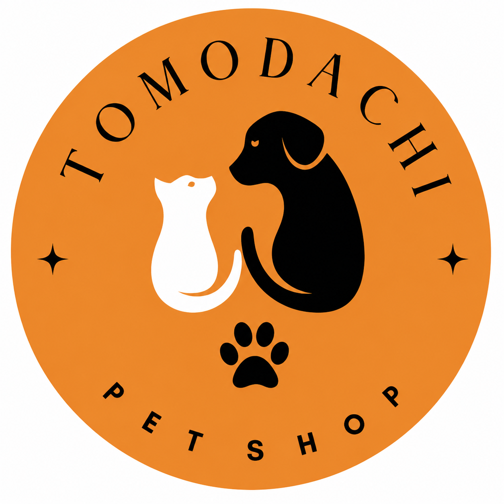

<p align="center">
  
</p>

<h1 align="center">🐾 Tomodachi Pet Shop</h1>

<p align="center">
  <strong>Sistem Informasi Manajemen Toko Hewan Peliharaan</strong><br/>
  Aplikasi kasir (POS), manajemen stok, laporan analitik, dan AI assistant — dalam satu platform terintegrasi.
</p>

<p align="center">
  
  
  
  
  
  
</p>

---

## 📋 Daftar Isi

- [Tentang Proyek](#-tentang-proyek)
- [Fitur Utama](#-fitur-utama)
- [User Roles & Hak Akses](#-user-roles--hak-akses)
- [Tampilan Aplikasi](#-tampilan-aplikasi)
- [Arsitektur Sistem](#-arsitektur-sistem)
- [Tech Stack](#-tech-stack)
- [Struktur Database (ERD)](#-struktur-database-erd)
- [Struktur Proyek](#-struktur-proyek)
- [Prasyarat](#-prasyarat)
- [Instalasi Lokal (Laragon / XAMPP)](#-instalasi-lokal-laragon--xampp)
- [Deployment Docker](#-deployment-docker)
- [Konfigurasi Environment Variables](#-konfigurasi-environment-variables)
- [Setup Flutter Frontend](#-setup-flutter-frontend)
- [Menjalankan Test](#-menjalankan-test)
- [API Endpoints](#-api-endpoints)
- [Akun Default (Seeder)](#-akun-default-seeder)
- [Cara Penggunaan Aplikasi](#-cara-penggunaan-aplikasi)
- [Troubleshooting](#-troubleshooting)
- [Dokumentasi Tambahan](#-dokumentasi-tambahan)
- [Lisensi](#-lisensi)

---

## 📖 Tentang Proyek

**Tomodachi Pet Shop** (友達ペットショップ — "Teman Pet Shop") adalah sistem informasi manajemen yang dirancang khusus untuk toko hewan peliharaan. Aplikasi ini mendigitalkan seluruh proses operasional toko — mulai dari pencatatan transaksi penjualan di kasir, pengelolaan inventori produk, hingga analisis bisnis berbasis AI.

### Visi

Menyediakan platform manajemen pet shop yang **modern, efisien, dan cerdas** — memberdayakan pemilik toko untuk mengambil keputusan bisnis berdasarkan data.

### Misi

| # | Misi |
|---|------|
| 1 | Mengelola inventori produk hewan peliharaan secara real-time |
| 2 | Mencatat setiap transaksi penjualan dengan akurat |
| 3 | Mengintegrasikan payment gateway (Midtrans) untuk pembayaran digital |
| 4 | Memberikan laporan penjualan dan analitik bisnis yang actionable |
| 5 | Menyediakan AI assistant untuk rekomendasi restock dan strategi bisnis |
| 6 | Mendukung akses multi-user dengan role-based access control (RBAC) |

### Siapa yang Menggunakan?

Aplikasi ini dirancang untuk **toko hewan peliharaan (pet shop)** dengan kebutuhan:

- Kasir yang menginput transaksi harian
- Admin/Manager yang mengelola katalog produk dan kategori
- Owner/Pemilik yang memantau performa bisnis secara menyeluruh

---

## ✨ Fitur Utama

### 1. 🔐 Authentication & Authorization

- Login dengan email, password, dan **CAPTCHA** keamanan
- Role-based access control dengan 3 role: **Owner**, **Admin**, **Kasir**
- Token-based authentication menggunakan Laravel Sanctum
- Logout dengan token invalidation
- Rate limiting untuk proteksi brute-force (5 percobaan / menit)

### 2. 🛒 Point of Sale (POS)

- Sistem kasir digital dengan antarmuka intuitif
- Pencarian produk secara real-time dengan filter kategori
- Keranjang belanja (cart) interaktif dengan kalkulasi otomatis
- Dukungan multiple metode pembayaran:
  - 💵 **Cash** — tunai langsung di toko
  - 💳 **Bank Transfer** — via Midtrans
  - 📱 **E-Wallet** — GoPay, OVO, DANA, dll. via Midtrans
- Cetak struk/receipt digital setelah transaksi berhasil
- Efek suara 🔊 saat pembayaran berhasil

### 3. 📦 Manajemen Produk & Stok

- CRUD produk lengkap dengan **gambar produk** (upload multi-platform)
- Organisasi produk berdasarkan **tipe hewan** (Kucing, Anjing, Hamster, Kelinci, Ikan, Burung) dan **sub-kategori** (Makanan, Obat, Perlengkapan)
- Tracking stok ganda: **offline** (di toko) dan **online**
- SKU (Stock Keeping Unit) unik untuk setiap produk
- Perhitungan **margin keuntungan** otomatis (buy price vs sell price)
- **Minimum threshold alert** — notifikasi saat stok menipis
- Soft delete — produk yang dihapus tidak hilang permanen (recoverable)

### 4. 📊 Dashboard & Laporan Analitik

- **Dashboard owner** dengan KPI utama:
  - Total penjualan hari ini, bulan ini
  - Jumlah transaksi
  - Rata-rata nilai transaksi
- Grafik **sales trending** (line chart)
- **Top products** — produk terlaris per periode
- **Category breakdown** — analisis penjualan per kategori hewan
- Riwayat transaksi detail dengan filter tanggal
- **Export laporan** ke PDF/Excel (platform-aware: desktop vs web)

### 5. 🤖 AI Assistant (Tommi)

- Chatbot AI bernama **Tommi** 🐱 — partner bisnis virtual
- Didukung oleh **OpenRouter API** (Qwen / GPT / model lainnya)
- Kemampuan AI:
  - 📈 Analisis performa penjualan bulanan
  - 📦 Rekomendasi restock berdasarkan prediksi kebutuhan 7 hari
  - 💡 Saran strategi bisnis, promosi, dan marketing
  - 📊 Menjawab pertanyaan seputar data inventaris dan keuangan
- Riwayat chat tersimpan per sesi
- Fallback otomatis ke model cadangan jika model utama rate-limited
- Domain-locked: hanya menjawab pertanyaan terkait pet shop & bisnis

### 6. 👥 Manajemen Akun (Owner)

- Registrasi user baru (hanya Owner yang bisa)
- CRUD akun pengguna (Admin, Kasir)
- Aktivasi/deaktivasi akun
- Statistik pengguna

### 7. 📱 Multi-Platform

- **Android** (APK) — aplikasi mobile utama
- **Web** (Flutter Web) — akses via browser
- **Windows / Linux / macOS** — build desktop
- Responsive layout: sidebar navigation di layar lebar, bottom navigation di mobile

---

## 👥 User Roles & Hak Akses

| Fitur | 👑 Owner | 🛡️ Admin | 🏪 Kasir |
|-------|:--------:|:--------:|:--------:|
| Login / Logout | ✅ | ✅ | ✅ |
| **POS Kasir** — input transaksi | ✅ | ❌ | ✅ |
| **Riwayat Transaksi** — lihat semua | ✅ | ✅ | ✅ |
| **Manajemen Produk** — CRUD | ❌ | ✅ | ❌ |
| **Kategori Produk** — CRUD | ❌ | ✅ | ❌ |
| **Lihat Harga Beli & Margin** | ✅ | ✅ | ❌ |
| **Dashboard Analitik** | ✅ | ❌ | ❌ |
| **Laporan Penjualan** | ✅ | ❌ | ❌ |
| **AI Assistant (Tommi)** | ✅ | ❌ | ❌ |
| **Manajemen Akun** — CRUD user | ✅ | ❌ | ❌ |

---

## 🖼️ Tampilan Aplikasi

### Halaman Login

Halaman login menampilkan antarmuka dengan brand identity Tomodachi Pet Shop. Terdapat form email & password dengan validasi CAPTCHA, serta tombol demo cepat (👑 Owner, 🛡️ Admin, 🏪 Kasir) untuk kemudahan testing.

### POS Kasir

Tampilan Point of Sale didesain untuk efisiensi kasir:

- **Panel kiri**: katalog produk dengan pencarian & filter kategori
- **Panel kanan**: keranjang belanja dengan total otomatis
- Setiap item menampilkan gambar, nama, harga, dan stok tersedia
- Tombol pembayaran dengan pilihan metode (Cash / E-Wallet / Transfer)

### Dashboard Analitik (Owner)

Dashboard eksklusif owner menampilkan:

- **KPI Cards** — total penjualan, jumlah transaksi, rata-rata transaksi
- **Grafik tren penjualan** — line chart interaktif
- **Top 5 produk terlaris** — beserta jumlah unit terjual
- **Category breakdown** — persentase penjualan per tipe hewan

### Manajemen Produk (Admin)

Tampilan manajemen produk dengan:

- Tabel produk lengkap (nama, SKU, kategori, harga beli/jual, margin, stok)
- Tombol tambah, edit, dan hapus produk
- Form produk dengan upload gambar
- Badge status stok (Aman / Menipis / Habis)

### AI Assistant — Tommi

Tampilan chat modern dengan:

- Bubble chat bergaya messaging app
- Tommi merespon dengan format terstruktur (heading, bullet points)
- Riwayat percakapan per sesi

### Manajemen Akun (Owner)

- Daftar semua akun user dengan role dan status
- Form registrasi user baru
- Edit dan hapus akun

---

## 🏗 Arsitektur Sistem

```
┌─────────────────────────────────────────────────────────────────┐
│                     Flutter Mobile / Web App                     │
│            (Android · iOS · Web · Windows · Linux · macOS)       │
└──────────────────────────┬──────────────────────────────────────┘
                           │
                    HTTP / REST API
                           │
┌──────────────────────────▼──────────────────────────────────────┐
│                                                                  │
│    ┌─────────────┐     Laravel 11 Backend     ┌──────────────┐  │
│    │   Nginx     │ ◄── Reverse Proxy ──────►  │   PHP-FPM    │  │
│    │   (Docker)  │                             │   (Docker)   │  │
│    └─────────────┘                             └──────┬───────┘  │
│                                                       │          │
│    ┌──────────────────────────────────────────────────┘          │
│    │                                                             │
│    ▼                                                             │
│    ┌─────────────┐     ┌──────────────┐     ┌────────────────┐  │
│    │  MySQL 8.0  │     │   Midtrans   │     │  OpenRouter AI │  │
│    │  (Docker)   │     │  Payment GW  │     │   (External)   │  │
│    └─────────────┘     └──────────────┘     └────────────────┘  │
│                                                                  │
│    ┌─────────────┐                                               │
│    │ MySQL Backup│  ◄── Otomatis setiap 24 jam (retensi 7 hari) │
│    │  (Docker)   │                                               │
│    └─────────────┘                                               │
│                                                                  │
└──────────────────────────────────────────────────────────────────┘
```

### Alur Kerja Sistem

1. **Client** (Flutter app) mengirim HTTP request ke backend API
2. **Nginx** menerima request dan meneruskan ke PHP-FPM (Laravel)
3. **Laravel** memproses request: autentikasi (Sanctum), validasi, business logic
4. **MySQL** menyimpan/mengambil data (produk, transaksi, user, dll.)
5. **Midtrans** memproses pembayaran digital (webhook notification)
6. **OpenRouter** memproses query AI dari owner (chat & analisis restock)
7. **Response** dikembalikan dalam format JSON ke Flutter app

---

## 🔧 Tech Stack

### Backend

| Komponen | Teknologi | Versi |
|----------|-----------|-------|
| Framework | Laravel | 11.x |
| Bahasa | PHP | ≥ 8.2 |
| Database | MySQL | 8.0 |
| Authentication | Laravel Sanctum | 4.x |
| Payment Gateway | Midtrans PHP SDK | 2.6 |
| HTTP Client | GuzzleHTTP | 7.x |
| Testing | PHPUnit | 10.x |
| Code Style | Laravel Pint | 1.x |

### Frontend

| Komponen | Teknologi | Versi |
|----------|-----------|-------|
| Framework | Flutter | 3.x |
| Bahasa | Dart | ≥ 3.11 |
| Font | Google Fonts (Plus Jakarta Sans) | 6.x |
| Chart | FL Chart | 0.66 |
| Secure Storage | flutter_secure_storage | 9.x |
| Image Picker | image_picker | 1.x |
| Network Images | cached_network_image | 3.x |
| Audio | audioplayers | 6.x |
| URL Launcher | url_launcher | 6.x |
| Date Formatting | intl | 0.19 |

### Infrastructure & DevOps

| Komponen | Teknologi |
|----------|-----------|
| Reverse Proxy | Nginx (Alpine) |
| Containerization | Docker & Docker Compose |
| SSL / CDN | Cloudflare (Origin Certificate) |
| Database Backup | Automated script (cron 24 jam) |
| E2E Testing | Playwright |
| Backend Testing | PHPUnit (13 test suites) |
| Domain | tomodachi-petshop.xyz |

---

## 📊 Struktur Database (ERD)

Database terdiri dari **8 tabel utama** dengan relasi berikut:

```
┌──────────┐       ┌──────────────┐       ┌───────────────────┐
│  roles   │       │    users     │       │   transactions    │
│──────────│       │──────────────│       │───────────────────│
│ id (PK)  │◄──────│ role_id (FK) │◄──────│ user_id (FK)      │
│ name     │ 1:N   │ name         │ 1:N   │ invoice_number    │
│          │       │ email        │       │ total_amount      │
│          │       │ password     │       │ payment_method    │
│          │       │ is_active    │       │ payment_status    │
│          │       │ phone        │       │ midtrans_tx_id    │
└──────────┘       └──────────────┘       └────────┬──────────┘
                                                    │ 1:N
                                          ┌─────────▼─────────┐
                                          │ transaction_items  │
                                          │───────────────────│
                                          │ transaction_id(FK) │
                                          │ product_id (FK)────┐
                                          │ quantity           │
                                          │ unit_price         │
                                          │ subtotal           │
                                          └────────────────────┘
                                                    │ N:1
┌──────────────┐       ┌───────────────┐   ┌───────▼──────────┐
│  categories  │       │    stocks     │   │    products      │
│──────────────│       │───────────────│   │──────────────────│
│ id (PK)      │◄──────│ product_id(FK)│──►│ id (PK)          │
│ name         │ 1:N   │ offline_qty   │1:1│ category_id (FK) │
│ animal_type  │       │ online_qty    │   │ name             │
│ sub_category │       │ min_threshold │   │ sku (UNIQUE)     │
│              │       │               │   │ buy_price        │
└──────────────┘       └───────────────┘   │ sell_price       │
                                           │ margin_%         │
┌─────────────────┐                        │ image_url        │
│ chat_histories  │                        │ deleted_at (soft)│
│─────────────────│                        └──────────────────┘
│ user_id (FK)    │
│ session_id      │
│ role (user/ai)  │
│ content         │
└─────────────────┘
```

### Tabel & Fungsi

| Tabel | Deskripsi |
|-------|-----------|
| `roles` | Definisi role user (owner, admin, kasir) |
| `users` | Akun pengguna dengan autentikasi & RBAC |
| `categories` | Kategori produk berdasarkan tipe hewan & sub-kategori |
| `products` | Katalog produk dengan harga beli, harga jual, dan margin |
| `stocks` | Tracking inventori (stok offline, online, threshold minimum) |
| `transactions` | Catatan transaksi penjualan dengan status pembayaran |
| `transaction_items` | Detail item per transaksi (line items) |
| `chat_histories` | Riwayat percakapan dengan AI assistant |
| `personal_access_tokens` | Token autentikasi Sanctum |

---

## 📁 Struktur Proyek

```
Project-Tomodachi-Pet-Shop/
│
├── backend/                         # 🔧 Laravel 11 REST API
│   ├── app/
│   │   ├── Http/
│   │   │   ├── Controllers/
│   │   │   │   └── Api/             # Controller per resource
│   │   │   │       ├── AiController.php
│   │   │   │       ├── AuthController.php
│   │   │   │       ├── CategoryController.php
│   │   │   │       ├── ProductController.php
│   │   │   │       ├── ReportController.php
│   │   │   │       ├── TransactionController.php
│   │   │   │       └── UserController.php
│   │   │   └── Middleware/           # Custom middleware (CheckRole, dll)
│   │   ├── Models/                   # Eloquent models (12 model)
│   │   │   ├── User.php
│   │   │   ├── Product.php
│   │   │   ├── Category.php
│   │   │   ├── Stock.php
│   │   │   ├── Transaction.php
│   │   │   ├── TransactionItem.php
│   │   │   ├── ChatHistory.php
│   │   │   └── ...
│   │   └── Services/                 # Business logic layer
│   │       ├── AiService.php         # Komunikasi OpenRouter AI
│   │       └── RestockAnalysisService.php
│   ├── database/
│   │   ├── migrations/               # 16 migration files
│   │   └── seeders/                  # Data awal & dummy data
│   ├── routes/api.php                # Definisi route API
│   ├── tests/Feature/                # 13 test suites (PHPUnit)
│   ├── Dockerfile                    # Docker image backend
│   └── .env.example
│
├── frontend/                         # 📱 Flutter App (Multi-Platform)
│   ├── lib/
│   │   ├── main.dart                 # Entry point aplikasi
│   │   ├── screens/
│   │   │   ├── splash_screen.dart    # Splash screen animasi
│   │   │   ├── loading_screen.dart   # Loading / auto-login
│   │   │   ├── login_screen.dart     # Login dengan CAPTCHA
│   │   │   ├── home_screen.dart      # Layout utama (sidebar/bottom nav)
│   │   │   ├── ai_chat_screen.dart   # Chat AI assistant (Tommi)
│   │   │   ├── product_management_screen.dart
│   │   │   ├── category_management_screen.dart
│   │   │   ├── owner_accounts_screen.dart
│   │   │   └── tabs/
│   │   │       ├── dashboard_tab.dart       # Dashboard analitik owner
│   │   │       ├── pos_tab.dart             # POS kasir
│   │   │       ├── products_tab.dart        # Daftar & manajemen produk
│   │   │       └── transactions_history_tab.dart
│   │   ├── models/                   # Data models (Dart)
│   │   ├── widgets/                  # Reusable widgets
│   │   ├── *_service.dart            # Service layer (API calls)
│   │   └── api_client*.dart          # HTTP client (platform-aware)
│   ├── assets/                       # Gambar, ikon, audio
│   ├── pubspec.yaml                  # Dependencies
│   ├── Dockerfile                    # Flutter Web build container
│   └── test/                         # Widget tests
│
├── docker/                           # 🐳 Docker & Deployment
│   ├── docker-compose.yml            # Development stack
│   ├── docker-compose.prod.yml       # Production stack
│   ├── backend.Dockerfile            # Backend image builder
│   ├── frontend.Dockerfile           # Flutter Web builder
│   ├── Makefile                      # Shortcut commands
│   ├── backup.sh                     # MySQL auto-backup script
│   ├── nginx/conf.d/
│   │   └── default.conf              # Nginx reverse proxy + SSL
│   ├── .env.example                  # Template env Docker
│   └── .env.laravel                  # Laravel env untuk Docker
│
├── e2e/                              # 🧪 End-to-End Testing
│   ├── playwright.config.js          # Konfigurasi Playwright
│   ├── tests/                        # 10 test specs
│   │   ├── 01-login.spec.js
│   │   ├── 02-kasir-pos.spec.js
│   │   ├── 03-admin-products.spec.js
│   │   ├── 04-owner-dashboard.spec.js
│   │   ├── 05-reports.spec.js
│   │   ├── 06-authorization.spec.js
│   │   └── ...
│   └── helpers/                      # Utility functions untuk test
│
├── docs/                             # 📚 Dokumentasi Lengkap
│   ├── PROJECT_OVERVIEW.md
│   ├── QUICK_START_AUTH.md
│   ├── schema_database.md
│   ├── api-contract/
│   │   ├── API_CONTRACT.md
│   │   ├── endpoints.json
│   │   └── endpoints.csv
│   ├── diagrams/
│   │   ├── ERD_Tomodachi_Petshop.md
│   │   └── erd-tomodachi-petshop.mmd
│   └── QA/                           # Laporan pengujian
│       ├── Test_Plan_*.docx
│       ├── Test_Case_*.docx
│       └── Quality_Measurement_Report_ISO25023_*.docx
│
├── scripts/                          # 🔨 Utility scripts
│   └── audit_whitebox_metrics.js
│
├── .env.example                      # Template environment root
└── README.md                         # 📄 Dokumentasi ini
```

---

## 📋 Prasyarat

### Instalasi Lokal

| Software | Versi Minimum | Keterangan |
|----------|---------------|------------|
| **PHP** | 8.2+ | Dengan ekstensi: `pdo_mysql`, `mbstring`, `openssl`, `gd` |
| **Composer** | 2.x | Dependency manager PHP |
| **MySQL** | 8.0+ / MariaDB 10.6+ | Database server |
| **Flutter SDK** | 3.x (Dart ≥ 3.11) | Framework frontend |
| **Git** | 2.x | Version control |
| **Laragon / XAMPP** | Terbaru | Local web server environment |

### Deployment Docker

| Software | Versi Minimum |
|----------|---------------|
| **Docker Engine** | 24+ |
| **Docker Compose** | v2+ |
| **Make** *(opsional)* | GNU Make (untuk Makefile shortcuts) |

---

## 🚀 Instalasi Lokal (Laragon / XAMPP)

### 1. Clone Repository

```bash
git clone https://github.com/your-username/Project-Tomodachi-Pet-Shop.git
cd Project-Tomodachi-Pet-Shop
```

### 2. Setup Backend (Laravel)

```bash
cd backend

# Install dependencies PHP
composer install
```

Buat file `.env` dari template:

```bash
# Windows (Command Prompt / PowerShell)
copy .env.example .env

# Git Bash / Linux / macOS
cp .env.example .env
```

Generate application key:

```bash
php artisan key:generate
```

Konfigurasi database di `backend/.env`:

```env
DB_CONNECTION=mysql
DB_HOST=127.0.0.1
DB_PORT=3306
DB_DATABASE=tomodachi_petshop
DB_USERNAME=root
DB_PASSWORD=
```

Konfigurasi service pihak ketiga (lihat [Environment Variables](#-konfigurasi-environment-variables)):

```env
# Midtrans Payment Gateway
MIDTRANS_SERVER_KEY=your-server-key
MIDTRANS_CLIENT_KEY=your-client-key
MIDTRANS_IS_PRODUCTION=false

# OpenRouter AI (opsional, untuk fitur AI Assistant)
OPENROUTER_API_KEY=your-api-key
OPENROUTER_MODEL=qwen/qwen3-next-80b-a3b-instruct:free
```

Buat database dan jalankan migration + seeder:

```bash
# Buat database "tomodachi_petshop" di MySQL terlebih dahulu, lalu:
php artisan migrate --seed
```

> **💡 Tip:** Untuk reset database dari awal: `php artisan migrate:fresh --seed`

Jalankan server backend:

```bash
php artisan serve --host=0.0.0.0 --port=8000
```

Buat symlink storage (untuk akses gambar produk):

```bash
php artisan storage:link
```

### 3. Verifikasi Backend

```bash
# Cek health endpoint
curl http://127.0.0.1:8000/api/health

# Cek semua route API
php artisan route:list --path=api

# Login test
curl -X POST http://127.0.0.1:8000/api/auth/login \
  -H "Content-Type: application/json" \
  -d '{"email": "owner@tomodachi.com", "password": "password123"}'
```

### 4. Setup Frontend (Flutter)

```bash
cd frontend

# Install dependencies
flutter pub get

# Jalankan di Chrome (web)
flutter run -d chrome --dart-define=API_BASE_URL=http://localhost:8000

# Jalankan di Android Emulator
flutter run --dart-define=API_BASE_URL=http://10.0.2.2:8000

# Jalankan di HP fisik (ganti IP sesuai jaringan lokal)
flutter run --dart-define=MOBILE_API_BASE_URL=http://192.168.1.xxx:8000
```

---

## 🐳 Deployment Docker

### Struktur File Docker

```
docker/
├── docker-compose.yml          # Development stack (build lokal)
├── docker-compose.prod.yml     # Production stack (image dari Docker Hub)
├── backend.Dockerfile          # Build image Laravel
├── frontend.Dockerfile         # Build Flutter Web
├── Makefile                    # Shortcut commands
├── backup.sh                   # Script backup MySQL otomatis
├── .env.example                # Template environment variables
├── .env.laravel                # Laravel env (mounted ke container)
└── nginx/conf.d/
    └── default.conf            # Konfigurasi Nginx + SSL
```

### Arsitektur Container

```
┌─────────────────────────────────────────────────────────────────┐
│                        Docker Compose                            │
│                                                                  │
│  ┌──────────────┐   ┌──────────────┐   ┌──────────────────────┐ │
│  │    nginx      │   │   laravel    │   │       mysql          │ │
│  │  (port 80/443)│──►│  (PHP-FPM)  │──►│    (port 3306)       │ │
│  │  Alpine image │   │ Custom image│   │   mysql:8.0 image    │ │
│  └──────────────┘   └──────────────┘   └──────────────────────┘ │
│                                                                  │
│  ┌──────────────────┐   ┌───────────────────────────────────┐   │
│  │  mysql_backup     │   │  flutter_builder (profile: build) │   │
│  │  24-jam cycle     │   │  Build Flutter Web assets         │   │
│  │  Retensi 7 hari   │   │  Output → Nginx static files     │   │
│  └──────────────────┘   └───────────────────────────────────┘   │
│                                                                  │
│  Network: tomodachi_net (bridge)                                 │
└─────────────────────────────────────────────────────────────────┘
```

### Development (Build Lokal)

```bash
cd docker

# Salin template environment
cp .env.example .env

# Edit .env — wajib isi semua nilai bertanda "replace-with-..."
# Lihat seksi Environment Variables di bawah

# Jalankan semua service
make up
# Atau: docker compose up -d

# Lihat logs
make logs

# Masuk ke shell Laravel container
make shell

# Jalankan migration + seeder
make migrate
# Atau: make fresh  (⚠️ HAPUS semua data!)

# Build Flutter Web (opsional)
docker compose --profile build up flutter_builder
```

### Production (Deploy ke VPS)

**Langkah 1** — Build & push image backend (dari laptop developer):

```bash
cd docker

# Set BACKEND_IMAGE di .env, contoh:
# BACKEND_IMAGE=dockerhubusername/tomodachi-backend:latest

make build-backend
# Ini akan: docker build + docker push
```

**Langkah 2** — Deploy di VPS:

```bash
# Clone / pull repository terbaru
git pull

cd docker

# Salin dan edit environment production
cp .env.example .env && nano .env

# Jalankan production stack
make prod-up

# Jalankan migration pertama kali
docker exec tomodachi_laravel php artisan migrate --seed
```

**Langkah 3** — Verifikasi:

```bash
# Cek semua container berjalan
docker ps

# Cek logs Laravel
make prod-logs

# Test API health
curl http://localhost/api/health
```

### MySQL Backup Otomatis

Backup berjalan **otomatis setiap 24 jam** dan menyimpan file `.sql.gz` selama 7 hari.

```bash
# Trigger backup manual
make backup              # (development)
make prod-backup          # (production)

# Lihat daftar file backup
make backup-list          # (development)
make prod-backup-list     # (production)

# Lihat log backup
make backup-logs
```

### Perintah Makefile Lengkap

| Perintah | Deskripsi |
|----------|-----------|
| `make up` | Jalankan semua container (dev) |
| `make down` | Matikan semua container |
| `make logs` | Lihat logs semua service |
| `make shell` | Masuk ke shell Laravel container |
| `make db` | Masuk ke MySQL CLI |
| `make migrate` | Jalankan `php artisan migrate` |
| `make fresh` | ⚠️ Reset database (`migrate:fresh --seed`) |
| `make backup` | Trigger backup MySQL manual |
| `make backup-logs` | Lihat log backup container |
| `make backup-list` | Tampilkan daftar file backup |
| `make build-backend` | Build & push image backend ke Docker Hub |
| `make build-backend-no-cache` | Build tanpa cache |
| `make prod-up` | Jalankan stack production |
| `make prod-down` | Matikan stack production |
| `make prod-logs` | Lihat logs production |
| `make prod-backup` | Backup manual di production |

---

## 🔐 Konfigurasi Environment Variables

### Laravel Backend (`backend/.env`)

| Variable | Keterangan | Contoh |
|----------|------------|--------|
| `APP_KEY` | Application key (auto-generate) | `base64:xxx...` |
| `APP_URL` | URL publik backend | `http://localhost:8000` |
| `DB_HOST` | Host database | `127.0.0.1` |
| `DB_PORT` | Port database | `3306` |
| `DB_DATABASE` | Nama database | `tomodachi_petshop` |
| `DB_USERNAME` | Username database | `root` |
| `DB_PASSWORD` | Password database | *(kosong untuk Laragon)* |

### Docker Environment (`docker/.env`)

| Variable | Keterangan | Contoh |
|----------|------------|--------|
| `APP_KEY` | Laravel app key | `base64:xxx...` |
| `DB_ROOT_PASSWORD` | Password root MySQL | `super_secret_root` |
| `DB_DATABASE` | Nama database | `tomodachi_petshop` |
| `DB_USERNAME` | User database | `tomodachi_user` |
| `DB_PASSWORD` | Password user database | `secret_db_pass` |
| `BACKEND_IMAGE` | Docker Hub image backend | `user/tomodachi-backend:latest` |
| `NGINX_PORT` | Port yang diekspos Nginx | `80` |
| `APP_URL` | URL publik aplikasi | `https://tomodachi-petshop.xyz` |
| `BACKUP_RETAIN_DAYS` | Lama penyimpanan backup (hari) | `7` |

### Midtrans Payment Gateway

Daftar di [dashboard.midtrans.com](https://dashboard.midtrans.com):

| Variable | Keterangan |
|----------|------------|
| `MIDTRANS_SERVER_KEY` | Server key dari Midtrans dashboard |
| `MIDTRANS_CLIENT_KEY` | Client key dari Midtrans dashboard |
| `MIDTRANS_IS_PRODUCTION` | `false` untuk sandbox, `true` untuk production |
| `MIDTRANS_IS_SANITIZED` | `true` — sanitize input |
| `MIDTRANS_IS_3DS` | `true` — enable 3D Secure |

### OpenRouter AI Assistant

Daftar di [openrouter.ai](https://openrouter.ai) dan buat API key (tersedia model gratis):

| Variable | Keterangan |
|----------|------------|
| `OPENROUTER_API_KEY` | API key dari OpenRouter |
| `OPENROUTER_MODEL` | Model utama (contoh: `qwen/qwen3-next-80b-a3b-instruct:free`) |
| `OPENROUTER_FALLBACK_MODELS` | Model cadangan dipisah koma |

---

## 📱 Setup Flutter Frontend

### Instalasi Dependensi

```bash
cd frontend
flutter pub get
```

### Menjalankan Aplikasi

```bash
# 🌐 Chrome (Web)
flutter run -d chrome --dart-define=API_BASE_URL=http://localhost:8000

# 📱 Android Emulator (backend di localhost)
flutter run --dart-define=API_BASE_URL=http://10.0.2.2:8000

# 📱 HP Fisik (ganti IP dengan IP laptop di jaringan yang sama)
flutter run --dart-define=MOBILE_API_BASE_URL=http://192.168.1.xxx:8000

# 📱 Via ngrok (HP fisik tanpa satu jaringan)
flutter run --dart-define=MOBILE_API_BASE_URL=https://xxxx.ngrok-free.app

# 🖥 Desktop (Windows / Linux / macOS)
flutter run -d windows --dart-define=API_BASE_URL=http://localhost:8000
```

### Build Release

```bash
# Build APK Android
flutter build apk --release
# Output: build/app/outputs/flutter-apk/app-release.apk

# Build Web (untuk deployment mandiri)
flutter build web --dart-define=API_BASE_URL=https://your-api-domain.com

# Build Web via Docker (otomatis)
# Web build dikerjakan oleh flutter_builder container:
docker compose --profile build up flutter_builder
```

---

## 🧪 Menjalankan Test

### Backend (PHPUnit)

```bash
cd backend

# Jalankan semua test
php artisan test

# Jalankan test spesifik
php artisan test --filter=AuthTest
php artisan test --filter=ProductCrudTest
php artisan test --filter=POSTransactionTest
```

**Test suites tersedia:**

| Test Suite | Deskripsi |
|-----------|-----------|
| `AuthApiTest` | Login, logout, register, token |
| `AuthTest` | Authentication flow lengkap |
| `CategoryApiTest` | CRUD kategori |
| `ProductApiTest` | API produk |
| `ProductCrudTest` | CRUD produk + upload gambar |
| `TransactionApiTest` | Transaksi API |
| `POSTransactionTest` | Flow POS kasir end-to-end |
| `ReportApiTest` | API laporan |
| `ReportTest` | Laporan & analitik |
| `SecurityRouteTest` | Proteksi route & RBAC |
| `LowStockNotificationTest` | Notifikasi stok menipis |
| `ApiErrorHandlingTest` | Error handling |

### E2E Testing (Playwright)

```bash
cd e2e

# Install dependencies
npm install

# Install browser Playwright
npx playwright install chromium

# Pastikan Flutter Web berjalan di port 8080:
# (di terminal terpisah) flutter run -d chrome --web-port 8080

# Jalankan semua E2E test
npx playwright test

# Jalankan test spesifik
npx playwright test tests/01-login.spec.js

# Buka HTML report setelah test
npx playwright show-report
```

**E2E test suites:**

| Test File | Skenario |
|-----------|----------|
| `01-login.spec.js` | Login semua role, validasi, error handling |
| `02-kasir-pos.spec.js` | Flow POS kasir lengkap |
| `03-admin-products.spec.js` | Manajemen produk oleh Admin |
| `04-owner-dashboard.spec.js` | Dashboard analitik Owner |
| `05-reports.spec.js` | Laporan penjualan |
| `06-authorization.spec.js` | RBAC & proteksi akses |
| `07-admin-dashboard.spec.js` | Dashboard Admin |
| `08-category.spec.js` | Manajemen kategori |
| `09-supplier.spec.js` | Fitur supplier |
| `10-customer.spec.js` | Fitur customer |

### Frontend (Widget Test)

```bash
cd frontend
flutter test
```

---

## 🌐 API Endpoints

### Public Routes (Tanpa Auth)

| Method | Endpoint | Deskripsi |
|--------|----------|-----------|
| `GET` | `/api/health` | Health check API |
| `GET` | `/api/auth/captcha` | Generate CAPTCHA gambar |
| `POST` | `/api/auth/login` | Login user |
| `POST` | `/api/midtrans/notification` | Webhook Midtrans |
| `GET` | `/api/product-images/{path}` | Akses gambar produk |

### Protected Routes (Semua Role)

| Method | Endpoint | Deskripsi |
|--------|----------|-----------|
| `POST` | `/api/auth/logout` | Logout (invalidate token) |
| `GET` | `/api/auth/me` | Data user yang sedang login |
| `GET` | `/api/categories` | Daftar semua kategori |
| `GET` | `/api/products` | Daftar semua produk |
| `GET` | `/api/products/{id}` | Detail produk |
| `GET` | `/api/products/categories` | Produk grouped by kategori |
| `GET` | `/api/transactions` | Riwayat transaksi |
| `GET` | `/api/transactions/{id}` | Detail transaksi |
| `GET` | `/api/transactions/{id}/receipt` | Cetak struk |

### Kasir & Owner Only

| Method | Endpoint | Deskripsi |
|--------|----------|-----------|
| `POST` | `/api/transactions` | Buat transaksi baru (checkout) |

### Admin & Owner Only

| Method | Endpoint | Deskripsi |
|--------|----------|-----------|
| `POST` | `/api/products` | Tambah produk baru |
| `POST` | `/api/products/{id}/update` | Update produk (multipart) |
| `PUT` | `/api/products/{id}` | Update produk (JSON) |
| `DELETE` | `/api/products/{id}` | Hapus produk (soft delete) |
| `POST` | `/api/categories` | Tambah kategori |
| `PUT` | `/api/categories/{id}` | Update kategori |
| `DELETE` | `/api/categories/{id}` | Hapus kategori |

### Owner Only

| Method | Endpoint | Deskripsi |
|--------|----------|-----------|
| `POST` | `/api/auth/register` | Registrasi user baru |
| `GET` | `/api/auth/accounts` | Daftar semua akun |
| `PUT` | `/api/auth/accounts/{id}` | Update akun user |
| `DELETE` | `/api/auth/accounts/{id}` | Hapus akun user |
| `GET` | `/api/users` | Daftar user (manajemen) |
| `POST` | `/api/users` | Tambah user |
| `GET` | `/api/users/stats` | Statistik user |
| `GET` | `/api/reports/sales` | Laporan penjualan |
| `GET` | `/api/reports/sales/summary` | Ringkasan penjualan |
| `GET` | `/api/reports/top-products` | Produk terlaris |
| `GET` | `/api/dashboard/analytics` | Data analitik dashboard |
| `POST` | `/api/ai/chat` | Kirim pesan ke AI Tommi |
| `GET` | `/api/ai/chat/history` | Riwayat chat AI |
| `GET` | `/api/ai/restock` | Analisis restock AI |

---

## 👤 Akun Default (Seeder)

Setelah menjalankan `php artisan migrate --seed`, akun berikut tersedia:

| Role | Nama | Email | Password |
|------|------|-------|----------|
| 👑 **Owner** | Pak Heri | `owner@tomodachi.com` | `password123` |
| 🛡️ **Admin** | Admin Utama | `admin@tomodachi.com` | `password123` |
| 🏪 **Kasir** | Budi Santoso | `kasir@tomodachi.com` | `password123` |

**Data seed tambahan:**

- 9 kategori produk (Kucing, Anjing, Hamster, Kelinci, Ikan, Burung — dengan sub: food, equipment, medicine)
- 2 produk contoh (Tomodachi Cat Food Tuna 1kg, Kalung Anjing Adjustable)
- Stok awal untuk setiap produk
- Data transaksi dummy (via `ProductAndTransactionSeeder`)

> **💡 Tip:** Di halaman login Flutter, gunakan tombol demo cepat (emoji 👑 🛡️ 🏪) untuk login otomatis tanpa ketik manual.

---

## 📖 Cara Penggunaan Aplikasi

### Alur Owner (Pemilik Toko)

1. **Login** dengan akun Owner (`owner@tomodachi.com` / `password123`)
2. Setelah login, Anda akan masuk ke **Dashboard Analitik** yang menampilkan:
   - KPI penjualan hari ini dan bulan ini
   - Grafik tren penjualan
   - Top produk terlaris
   - Category breakdown
3. Navigasi ke **Manajemen Akun** untuk:
   - Melihat daftar semua user (admin & kasir)
   - Menambah user baru
   - Mengedit atau menghapus user
4. Navigasi ke **AI Asisten (Tommi)** untuk:
   - Bertanya tentang performa penjualan ("Berapa penjualan bulan ini?")
   - Meminta rekomendasi restock ("Produk apa yang perlu restock?")
   - Mendiskusikan strategi bisnis ("Bagaimana cara meningkatkan penjualan?")

### Alur Admin (Manager Toko)

1. **Login** dengan akun Admin (`admin@tomodachi.com` / `password123`)
2. Masuk ke **Manajemen Produk**:
   - Lihat daftar semua produk dengan stok, harga, dan margin
   - Tambah produk baru (nama, SKU, kategori, harga beli/jual, gambar)
   - Edit atau hapus produk yang ada
3. Navigasi ke **Kategori Produk**:
   - Kelola kategori berdasarkan tipe hewan dan sub-kategori
   - Tambah, edit, atau hapus kategori

### Alur Kasir

1. **Login** dengan akun Kasir (`kasir@tomodachi.com` / `password123`)
2. Masuk ke **POS Kasir**:
   - Cari produk dari katalog (search & filter)
   - Tambahkan produk ke keranjang
   - Atur jumlah item
   - Pilih metode pembayaran (Cash / E-Wallet / Transfer)
   - Proses checkout → cetak struk digital
3. Navigasi ke **Riwayat Transaksi**:
   - Lihat semua transaksi yang telah diproses
   - Filter berdasarkan tanggal
   - Lihat detail dan cetak ulang struk

---

## ❓ Troubleshooting

### ❌ `SQLSTATE[HY000] [2002] Connection refused`

Database MySQL belum berjalan. Jalankan Laragon/XAMPP terlebih dahulu, atau `make up` jika pakai Docker.

### ❌ `php artisan key:generate` gagal

Pastikan file `.env` sudah ada:
```bash
cp .env.example .env
```

### ❌ Flutter: `SocketException: Connection refused`

- **Android Emulator** → gunakan `10.0.2.2` bukan `localhost`
- **HP Fisik** → pastikan backend dijalankan dengan `--host=0.0.0.0` dan firewall mengizinkan port 8000
- **Web** → pastikan CORS dikonfigurasi di `config/cors.php`

### ❌ Login gagal — HTTP 429 (Too Many Requests)

Rate limiting aktif. Tunggu **1 menit** setelah 5 kali percobaan login gagal.

### ❌ AI Assistant tidak merespons

1. Periksa `OPENROUTER_API_KEY` di `.env`
2. Pastikan API key valid — bisa didapat gratis di [openrouter.ai](https://openrouter.ai)
3. Periksa `OPENROUTER_MODEL` — model mungkin tidak tersedia
4. Cek log: `storage/logs/laravel.log`

### ❌ Midtrans payment error

1. Pastikan `MIDTRANS_SERVER_KEY` dan `MIDTRANS_CLIENT_KEY` sesuai environment (`sandbox` vs `production`)
2. Untuk testing, gunakan mode **sandbox** (`MIDTRANS_IS_PRODUCTION=false`)
3. Cek webhook URL di Midtrans Dashboard → Settings → Payment Notification URL

### ❌ Gambar produk tidak muncul

Jalankan:
```bash
cd backend
php artisan storage:link
```

### ❌ Docker container backup tidak muncul

```bash
# Pastikan backup.sh memiliki izin eksekusi (Linux/macOS)
chmod +x docker/backup.sh

# Restart container backup
docker compose restart mysql_backup
```

### ❌ Flutter build error

```bash
cd frontend
flutter clean
flutter pub get
flutter run
```

### ❌ CORS Error di Web

Edit `backend/config/cors.php`:
```php
'allowed_origins' => ['*'],  // Untuk development
```

---

## 📚 Dokumentasi Tambahan

Dokumentasi lengkap tersedia di folder `docs/`:

| Dokumen | Deskripsi |
|---------|-----------|
| [PROJECT_OVERVIEW.md](docs/PROJECT_OVERVIEW.md) | Gambaran umum proyek, arsitektur, dan fitur |
| [QUICK_START_AUTH.md](docs/QUICK_START_AUTH.md) | Panduan cepat autentikasi & RBAC |
| [schema_database.md](docs/schema_database.md) | Skema database lengkap dengan ERD |
| [API_CONTRACT.md](docs/api-contract/API_CONTRACT.md) | Kontrak API lengkap (request/response) |
| [endpoints.json](docs/api-contract/endpoints.json) | Definisi endpoint dalam format JSON |
| [ERD_Tomodachi_Petshop.md](docs/diagrams/ERD_Tomodachi_Petshop.md) | Entity Relationship Diagram |
| [POSTMAN_TEST_GUIDE.md](backend/POSTMAN_TEST_GUIDE.md) | Panduan testing API dengan Postman |

### Koleksi Postman

Import file berikut ke Postman untuk testing API:

- `backend/Tomodachi-Pet-Shop.postman_collection.json`
- `backend/Tomodachi-Pet-Shop-Environment.postman_environment.json`

### Laporan QA & Pengujian

| Dokumen | Deskripsi |
|---------|-----------|
| `docs/QA/Test_Plan_*.docx` | Test plan proyek |
| `docs/QA/Test_Case_Summary_Report_*.docx` | Ringkasan hasil test case |
| `docs/QA/Quality_Measurement_Report_ISO25023_*.docx` | Laporan pengukuran kualitas ISO 25023 |
| `docs/QA/TestCase_Tomodachi_PetShop_API.docx` | Test case detail API |

---

## 🔒 Keamanan

| Aspek | Implementasi |
|-------|-------------|
| **Authentication** | Laravel Sanctum (Token-based) |
| **Authorization** | Role-based Access Control (RBAC) dengan middleware `check.role` |
| **Password** | Bcrypt hashing |
| **Rate Limiting** | Throttle pada login (5/menit), register, webhook, AI chat |
| **Input Validation** | Request validation di setiap endpoint |
| **CORS** | Konfigurasi allowed origins |
| **SSL** | Cloudflare Origin Certificate + TLS 1.2/1.3 |
| **Headers** | X-Frame-Options, X-Content-Type-Options, HSTS, Referrer-Policy |
| **Soft Delete** | Data produk yang dihapus tidak hilang permanen |
| **Secure Storage** | `flutter_secure_storage` untuk menyimpan token di client |
| **CAPTCHA** | Verifikasi visual di halaman login |

---

## 📄 Lisensi

**Tomodachi Pet Shop** © 2024–2026. All rights reserved.

---

<p align="center">
  <strong>Built with ❤️ for Pet Shop Management</strong><br/>
  <sub>Laravel 11 · Flutter 3 · MySQL 8 · Docker · Midtrans · OpenRouter AI</sub>
</p>