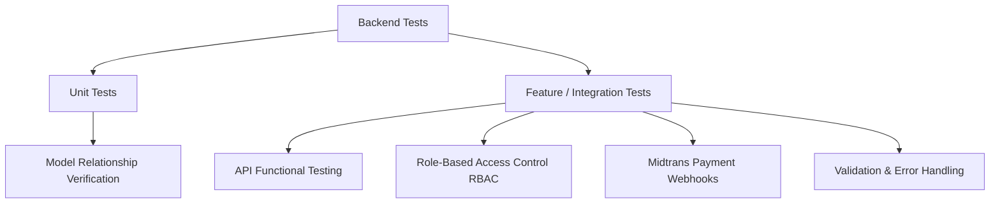

# Backend Test Plan - Project Tomodachi Pet Shop

Dokumen ini adalah **Test Plan (Rencana Pengujian)** formal untuk komponen backend aplikasi **Project Tomodachi Pet Shop**. Dokumen ini merinci cakupan, strategi, lingkungan, serta pembagian skenario pengujian guna memastikan kualitas dan keandalan sistem API sebelum dirilis.

---

## 1. Informasi Dokumen
* **Proyek:** Project Tomodachi Pet Shop (Backend)
* **Tanggal Pembuatan:** 8 Juli 2026
* **Status:** Approved (Lulus 179 Tes, 460 Assertions)
* **Target Lingkungan:** Testing (Local / CI Server)

---

## 2. Tujuan & Cakupan Pengujian

### 2.1 Tujuan
* Memverifikasi kebenaran logika pemrosesan transaksi belanja, potongan stok barang per kanal (online & offline), serta integrasi *payment gateway* Midtrans.
* Memastikan keamanan endpoint melalui Role-Based Access Control (RBAC) ketat (Owner, Admin, Kasir).
* Memvalidasi kestabilan API dari input-input tidak valid (angka negatif, kuantitas nol, data kosong).

### 2.2 Cakupan Pengujian (In-Scope)
* **Fungsionalitas API:** Autentikasi, CRUD Produk, CRUD Kategori, POS Checkout, Cetak Struk, Laporan Penjualan, Dashboard KPI.
* **Integrasi Pembayaran:** Notifikasi callback Midtrans (Settlement, Expired, Cancelled, Signature Validation).
* **Otorisasi Keamanan:** Pengujian akses tamu (*guest*), pembatasan akses kasir untuk menu owner.
* **Penanganan Error:** Validasi input, respons error 404 (Not Found) dan 405 (Method Not Allowed).

### 2.3 Di luar Cakupan (Out-of-Scope)
* Pengujian antarmuka pengguna grafis (UI/UX) di Flutter Frontend (dilakukan pada test plan terpisah).
* Pengujian beban dan kapasitas server (*Load & Performance Testing*).

---

## 3. Strategi & Tipe Pengujian

Pengujian dilakukan menggunakan **PHPUnit** di framework Laravel dengan pembagian sebagai berikut:



### 3.1 Unit Testing
Fokus pada integritas relasi tabel di tingkat Model Eloquent. Memastikan relasi database tidak terputus saat ada perubahan migrasi.

### 3.2 Feature/Integration Testing
Fokus pada pengujian siklus request-response API lengkap. Database dikosongkan dan di-seed ulang pada setiap test case menggunakan trait `RefreshDatabase` untuk memastikan independensi data.

### 3.3 Security / Matrix Otorisasi (RBAC)
Menggunakan *Data Provider* PHPUnit untuk menguji rute yang sama dengan berbagai status login (Owner, Admin, Kasir, dan Guest) untuk memverifikasi hak akses secara efisien.

---

## 4. Statistik Ringkasan Tes (Total 179 Tes)

Berdasarkan eksekusi test suite, berikut adalah pembagian statistik total kasus uji terotomatisasi:

| Modul Fitur | Test File | Jumlah Test Case | Keterangan |
| :--- | :--- | :---: | :--- |
| **Model & Relasi DB** | `ModelRelationshipTest.php` | 4 | Menguji relasi antar tabel (User, Role, Product, Category, dll). |
| **Keamanan Rute (RBAC)** | `SecurityRouteTest.php` | 43 | Menguji semua route dengan multi-user role (Guest, Kasir, Owner). |
| **Autentikasi & Akun** | `AuthTest.php`, `AuthApiTest.php` | 19 | Login, logout, registrasi staf baru, update & hapus akun, captcha. |
| **Manajemen Kategori** | `CategoryApiTest.php` | 10 | CRUD kategori, sorting kategori produk. |
| **Manajemen Produk** | `ProductCrudTest.php`, `ProductApiTest.php` | 25 | CRUD produk, validasi SKU unik, search, filter jenis hewan. |
| **Transaksi & Checkout** | `TransactionApiTest.php`, `POSTransactionTest.php`| 28 | POS checkout, validasi stok, validasi angka negatif & nol. |
| **Callback Midtrans** | `TransactionApiTest.php` (Midtrans) | 5 | Validasi signature key, settlement sukses, expired, cancel restocking. |
| **Laporan & Dashboard** | `ReportApiTest.php`, `ReportTest.php` | 22 | Laporan pendapatan harian/bulanan, KPI dashboard, top-products. |
| **Error Handling** | `ApiErrorHandlingTest.php` | 3 | Penanganan fallback route 404, HTTP method 405, error validasi 422. |
| **Total Keseluruhan** | **14 Test Files** | **179 Test Cases** | **Lulus 100% (460 Assertions)** |

---

## 5. Lingkungan Pengujian & Konfigurasi
* **Framework:** Laravel 10.x / 11.x
* **Bahasa Pemrograman:** PHP 8.2+
* **Database Driver:** SQLite (`:memory:`)
* **Environment Variable (`phpunit.xml`):**
  ```xml
  <env name="DB_CONNECTION" value="sqlite"/>
  <env name="DB_DATABASE" value=":memory:"/>
  <env name="MIDTRANS_SERVER_KEY" value="server-key-test"/>
  ```

---

## 6. Kriteria Kelulusan & Tingkat Keparahan Defect (Bug Severity)

Setiap temuan defect diklasifikasikan menggunakan kriteria keparahan berikut:

* **BLOCKER (S1):** Menghentikan jalannya tes otomatis (misal: migrasi database gagal, error sintaks fatal PHP).
* **CRITICAL (S2):** Logika bisnis inti rusak (misal: stok produk tidak terpotong saat checkout sukses, REST API crash / 500 server error).
* **MAJOR (S3):** Otorisasi gagal atau data salah (misal: Kasir bisa mengakses laporan Owner, perhitungan matematika total diskon/tax salah).
* **MINOR (S4):** Validasi tidak lengkap atau pesan respons kurang deskriptif.

**Kriteria Kelulusan Rilis:** 100% test case otomatis harus berstatus **PASS** (Zero Blocker, Critical, dan Major defects).
