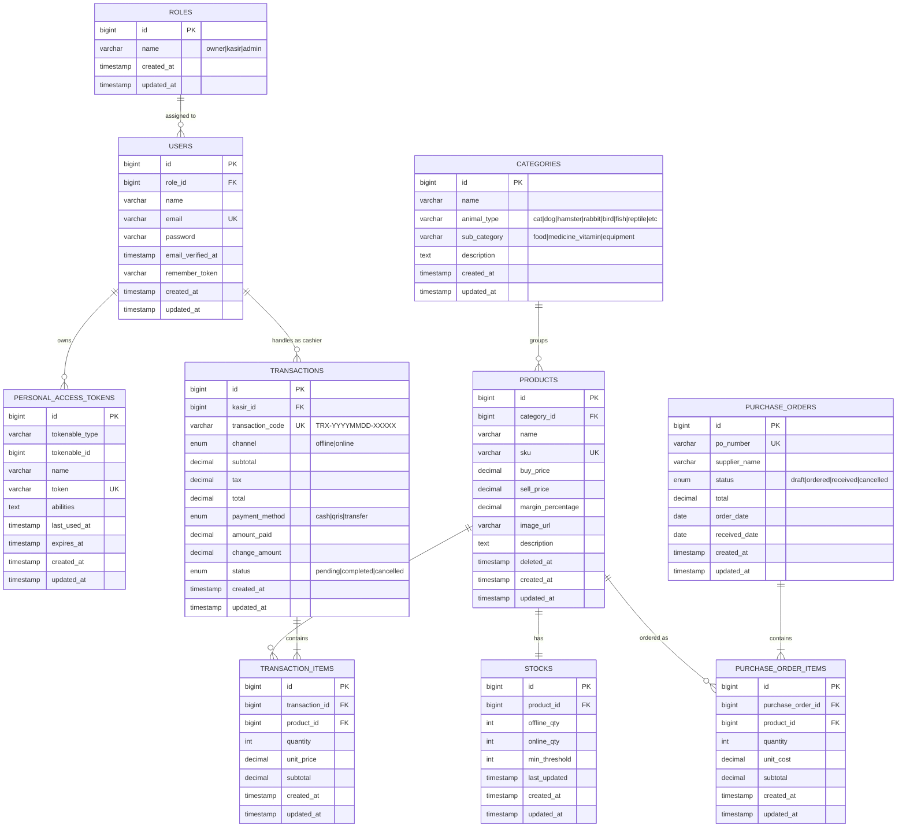

# ERD Tomodachi Pet Shop

File ini dibuat ulang berdasarkan SRS `SRS_Tomodachi_Petshop_v1.0 2 (1).docx`, terutama bagian:

- `3.5 API Contract`
- `4.1 Autentikasi & Manajemen Pengguna`
- `4.2 Manajemen Produk`
- `4.3 Point of Sale (POS)`
- `4.4 Dashboard Analitik & Laporan Penjualan`
- `6. Other Requirements`
- `Appendix B.4 Entity Relationship Diagram (ERD)`

Dashboard dan laporan tidak dibuat sebagai tabel terpisah karena pada SRS keduanya berupa hasil agregasi dari `transactions`, `transaction_items`, `products`, `categories`, dan `stocks`.

## Catatan Implementasi

- `roles` mengikuti RBAC pada SRS: owner, kasir, dan admin.
- `personal_access_tokens` mengikuti pilihan autentikasi Laravel Sanctum yang disebutkan di SRS.
- `stocks` memisahkan stok `offline_qty` dan `online_qty`, sesuai kebutuhan POS offline dan rekonsiliasi online.
- `transactions.kasir_id` mengarah ke `users.id`.
- `products.deleted_at` disediakan untuk soft delete produk.
- `purchase_orders` dan `purchase_order_items` dimasukkan karena disebutkan pada relasi ERD di Appendix B.4 SRS.
