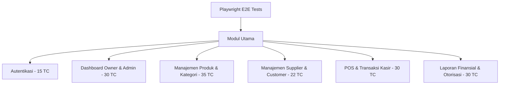

# Frontend E2E Test Plan (Playwright) - Tomodachi Pet Shop

Dokumen ini merinci **Test Plan (Rencana Pengujian)** untuk otomatisasi pengujian *End-to-End (E2E)* di sisi frontend aplikasi **Tomodachi Pet Shop** menggunakan **Playwright**. Pengujian ini berfokus pada validasi fungsionalitas visual, logika antarmuka kasir, dan interaksi pengguna pada web berbasis Flutter.

---

## 1. Informasi Dokumen
* **Proyek:** Tomodachi Pet Shop (Frontend Flutter Web)
* **Testing Tool:** Playwright (Node.js)
* **Tanggal Pembuatan:** 8 Juli 2026
* **Status:** Draft / Active (Ready for Execution)
* **Target Lingkungan:** Staging / Local Testing

---

## 2. Tujuan & Strategi Otomatisasi (Flutter Web)

### 2.1 Tantangan Khusus Flutter Web
Flutter Web merender komponen UI ke dalam elemen Canvas / custom Semantic Tree (`flt-semantics` & `flt-semantics-placeholder`). Hal ini membuat selector CSS standar (seperti ID atau Class CSS biasa) tidak dapat digunakan secara reliabel. 

### 2.2 Strategi Penemuan Elemen (Locator Strategy)
Pengujian E2E Playwright pada aplikasi ini mengadopsi taktik berikut:
1. **Aria-Labels & Accessibility Tree:** Menggunakan atribut penanda aksesibilitas bawaan Flutter untuk mendeteksi kolom input dan tombol.
   * Contoh pencarian email field: `page.locator('input[aria-label*="Email" i]')`
   * Contoh pencarian tombol: `page.locator('flt-semantics[role="button"]', { hasText: 'Sign In' })`
2. **Jeda Rendering (Flutter Bootstrapping):** Flutter Web membutuhkan waktu pemuatan engine awal yang lebih lama. Test case menyertakan helper `waitForFlutterApp` sebelum melakukan aksi apa pun.
3. **Sequential Execution:** Mengingat backend memotong stok dan mencatat transaksi langsung ke database, test suite dikonfigurasi untuk berjalan secara berurutan (**sequential**) dengan `workers: 1` guna menghindari tabrakan state data.

---

## 3. Cakupan Pengujian E2E (In-Scope)

Matriks pengujian mencakup skenario fungsionalitas lintas modul (total **162 skenario**):



### Rincian Pembagian Skenario (Total 162 Test Cases)
1. **Authentication (15 TC):** Alur login sukses (Admin, Kasir, Owner), login gagal (password salah, email kosong, format salah), proteksi keamanan (SQL injection, XSS pada form), double-submit login, session expired, dan logout.
2. **Dashboard Owner & Admin (30 TC):** Tampilan metrik KPI (sales, produk, pelanggan), grafik tren pendapatan, filter rentang waktu (today, weekly, monthly), reload, widget loading state, dan penanganan API error.
3. **Manajemen Produk & Kategori (35 TC):** CRUD produk (tambah produk, edit nama/harga/stok, validasi SKU duplikat, upload gambar), CRUD kategori produk terkelompok, search & pagination, dan safety price level.
4. **Manajemen Supplier & Customer (22 TC):** CRUD data supplier, CRUD data pelanggan (umum & member), integrasi potongan diskon khusus member pada kasir.
5. **POS & Transaksi Kasir (30 TC):** Cari/scan produk, tambah ke keranjang belanja, manipulasi kuantitas item, penolakan kuantitas melebihi stok, diskon nominal/persen, integrasi voucher, checkout tunai/QRIS/transfer, pencetakan struk belanja, dan riwayat transaksi.
6. **Laporan & Otorisasi Rute (30 TC):** Tarik laporan harian/mingguan/bulanan, export ke PDF/Excel, filter tanggal, otorisasi rute langsung (URL redirection) kasir vs owner, token JWT expired, dan multi-login session.

---

## 4. Lingkungan Pengujian & Konfigurasi

### 4.1 Konfigurasi Playwright (`playwright.config.js`)
* **Timeout Per Tes:** 60.000 ms (60 detik)
* **Timeout Assertion:** 15.000 ms
* **Retry:** 1x retry jika tes gagal akibat fluktuasi jaringan.
* **Workers:** `1` (sequential execution).
* **Browsers:** Google Chrome (Chromium).
* **Artifacts:** Video & screenshot disimpan otomatis hanya jika test mengalami kegagalan (`only-on-failure` / `retain-on-failure`).

### 4.2 Port & Koneksi Lokal
* **Frontend Web URL:** `http://localhost:8080` (Jalankan via `flutter run -d chrome --web-port 8080`)
* **Backend API URL:** `http://localhost:8000` (Jalankan via `php artisan serve`)

---

## 5. Cara Menjalankan Pengujian E2E

Seluruh perintah dijalankan dari dalam direktori `e2e/`:

1. **Instalasi Dependensi:**
   ```bash
   npm install
   ```
2. **Menjalankan Semua Pengujian (Headless Mode):**
   ```bash
   npm run test
   ```
3. **Menjalankan dengan Antarmuka Visual (Playwright UI Mode - Direkomendasikan):**
   ```bash
   npm run test:ui
   ```
4. **Menjalankan Spesifik Modul:**
   * Modul Login: `npm run test:login`
   * Modul Kasir/POS: `npm run test:kasir`
   * Modul CRUD Produk: `npm run test:admin`
   * Modul Owner: `npm run test:owner`
5. **Melihat Laporan Hasil Pengujian (HTML Report):**
   ```bash
   npm run test:report
   ```

---

## 6. Kriteria Penerimaan (Acceptance Criteria)
1. **Lulus 100%:** Seluruh 162 skenario E2E harus berstatus **PASS** sebelum dirilis ke tahap production.
2. **Nol Bug Kritis:** Tidak ada bug dengan kategori *Blocker* atau *Critical* yang memutus alur POS belanja kasir.
3. **Penyimpanan Laporan:** PDF/HTML report dan rekaman video test yang gagal harus terarsip dengan baik di folder `test-results/`.
